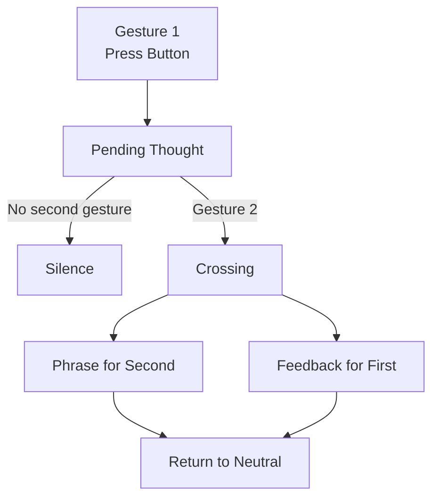

> _A thought does not need an answer to exist._

TOU is a small system for expressing **presence without obligation**.
It is not chat, not messaging, not notification.
A thought can be sent, and it may or may not be met by another.
Meaning emerges **only when two thoughts cross**.

---

## What TOU Is

- A **gesture**, not a request
- A system about **timing**, not speed
- An experience about **presence**, not response

> _Thinking of you is a gift, not a question._

---

## What TOU Is Not

- ❌ Chat
- ❌ Messaging app
- ❌ Notifications
- ❌ Read receipts
- ❌ Performance or competition

Silence is a valid outcome.

---

## Core Rules (Non‑Negotiable)

1. **The first gesture asks for nothing**
2. **The second gesture closes the cycle**
3. **Time is never shown**
4. **Silence is never punished**
5. **Technology never explains itself**

---

## The Only Gesture

There is only one action:

> **Press the button**

Whether physical (ESP32) or virtual (web app), it always means:

> _“In this moment, I am thinking of you.”_

It never means:

- reply
- acknowledgement
- obligation

---

## States of TOU

TOU lives in three simple states:

### 1. Neutral

- Nothing pending
- You may send a thought

### 2. Pending

- A thought exists
- No timer, no pressure
- Nothing visible or explicit

> _Something may happen, or may not._

### 3. Concluded

- Two thoughts crossed
- A phrase appears
- The moment is complete

> _This happened._

---

## Time & Sintonia

Time in TOU is:

- invisible
- non‑numeric
- non‑competitive

It exists only to shape meaning.

Time becomes **language**, not data.

Example phrases:

- “Ti pensavo proprio ora”
- “I nostri pensieri si sono sfiorati”
- “È da un po’ che ti penso”

No seconds. No percentages.

---

## Asymmetric Feedback

When a crossing happens:

- **Second person** receives the **phrase** (sintonia)
- **First person** receives a **gentle feedback**

  > _“Il tuo pensiero è arrivato.”_

This asymmetry is intentional.

---

## Architecture (Simple & Clear)

```
React App  ↔  MQTT  ↔  ESP32 Device
```

- **ESP32** = body (gesture, light, sound)
- **React** = mind (meaning, timing, narrative)
- **MQTT** = neutral transport (no logic)

The device never decides.
The app never demands.

---

## Flow Diagram



---

## Device Behavior (ESP32)

- Button press → send gesture
- Incoming thought → light + sound
- No timing logic
- No interpretation

> _The device feels. It does not think._

---

## Interface Philosophy

- Nothing urges
- Nothing counts
- Nothing insists

The system makes **space**, not demands.

---

## Status

TOU is an ongoing exploration.

Focus:

- clarity of meaning
- emotional correctness
- minimal interaction

Not optimized.
Not loud.
Not fast.

---

> _A thought may fade.
> A crossing becomes meaning._

           ┌──────────────────────┐
           │        NEUTRO        │
           │  nessun ciclo aperto │
           └──────────┬───────────┘
                      │
          (GESTO 1: qualcuno preme)
                      │
                      ▼
        ┌────────────────────────────┐
        │          PENDING           │
        │  primo gesto registrato    │
        │  (timestamp salvato)       │
        └──────────┬─────────────────┘
                   │
      ┌────────────┴─────────────┐
      │                          │
      │                          │
      ▼                          ▼

┌───────────────┐ ┌────────────────┐
│ React preme │ │ ESP32 preme │
│ (React è 2°) │ │ (ESP32 è 2°) │
└───────┬───────┘ └───────┬────────┘
│ │
│ │
▼ ▼
┌────────────────┐ ┌────────────────────┐
│ FRASE su React │ │ FRASE su ESP32 │
│ (5 secondi) │ │ (OLED, 5 secondi) │
└───────┬────────┘ └────────┬───────────┘
│ │
│ │
▼ ▼
┌────────────────────┐ ┌────────────────────┐
│ feedback a ESP32 │ │ feedback a React │
│ (persistente) │ │ (persistente) │
└──────────┬─────────┘ └──────────┬─────────┘
│ │
└───────────┬────────────┘
▼
┌────────────────┐
│ CICLO │
│ CHIUSO │
└────────────────┘
│
(nuovo gesto cancella feedback)
│
▼
┌────────────────┐
│ NEUTRO │
└────────────────┘
